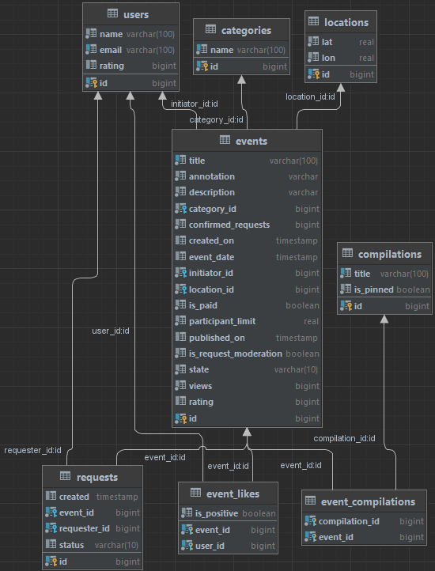
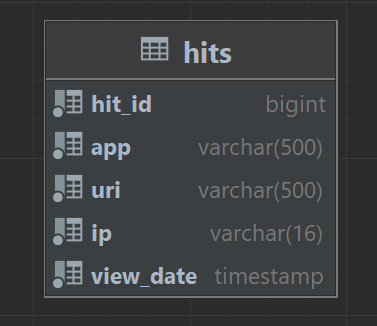
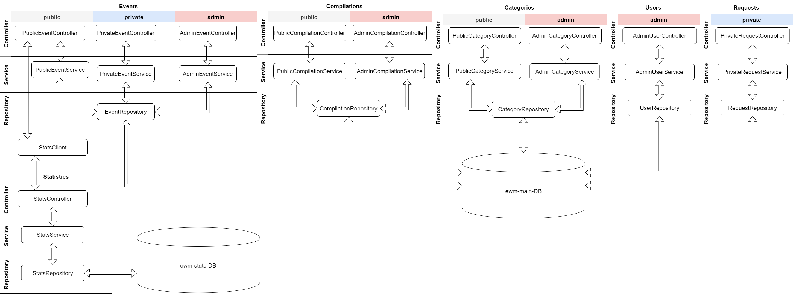

# java-explore-with-me

### [Pull Request](https://github.com/Artemev1986/java-explore-with-me/pull/1)

## Description
This application is a poster where you can offer any event from an exhibition to going to the cinema
and recruit a company to participate in it.

The application consists of two services:
1. The main service contains everything necessary for the product to work.
[Swagger main service specification](ewm-main-service-spec.json)</br>
2. Statistics service - stores the number of views and allows you to make various selections to analyze the application.
[Swagger statistics service specification](ewm-stats-service-spec.json)</br>


## ER-Diagram of the database of the main service


## ER-Diagram of the statistics service database


## Project Service Interaction Architecture


### Main service

The main service API is divided into three parts.
1. Public, available without registration to any network user.
2. Private, available only to authorized users.
3. Administrative, for service administrators.


Each part has its own requirements.

### Public API features
The public API provides the ability to search and filter events:
1. Sorting of the list of events can be organized either by the number of views, which should be requested in the statistics service, or by the dates of the events.
2. When viewing the list of events, only brief information about the events is returned.
3. Viewing detailed information about a particular event is displayed through a separate endpoint.
4. Each event belongs to one of the categories fixed in the application.
5. It is possible to get all available categories and collections of events (these collections will be compiled by resource administrators).
6. Each public request for a list of events or complete information about the event is recorded by the statistics service.

### API features for authorized users
The closed part of the API is designed to implement the capabilities of registered users of the product.
1. Authorized users have the ability to add new events to the application, edit them and view them after they are added.
2. It is possible to apply for participation in events of interest.
3. The creator of the event can confirm requests submitted by other users of the service.

### API features for administrator
The administrative part of the API provides the ability to configure and maintain the service.
1. You can add, modify and delete categories for events.
2. You can add, remove and pin on the main page of the collection of events.
3. It is possible to moderate events posted by users - publication or rejection.
4. You can also manage users - adding, viewing and deleting.

### Statistics service

The second service, statistics, is designed to collect information:
1. About the number of users accessing the lists of events.
2. About the number of requests for detailed information about the event. Based on this information, statistics about the operation of the application are generated.
   Functionality of the statistics service:
   • recording information that a request to an API endpoint has been processed;
   • providing statistics for the selected dates for the selected endpoint.

### How to run this project :

#### First you need to build the project

```sh
##build the project
mvn clean install
```

#### Next, you can build and run containers

```sh
##start up all containers. Use the -d option to start up in deamon mode
docker-compose up
```

### How to stop this project :
```sh

##stop the running containers
docker-compose stop
```